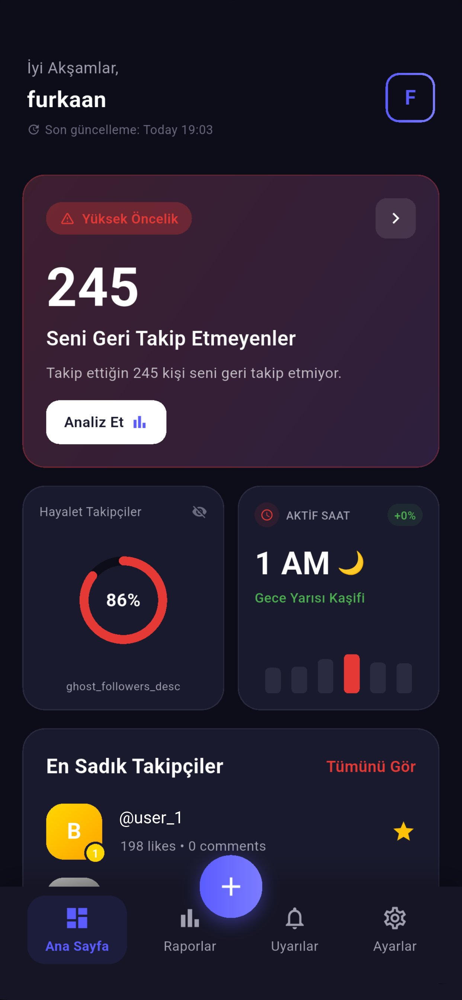
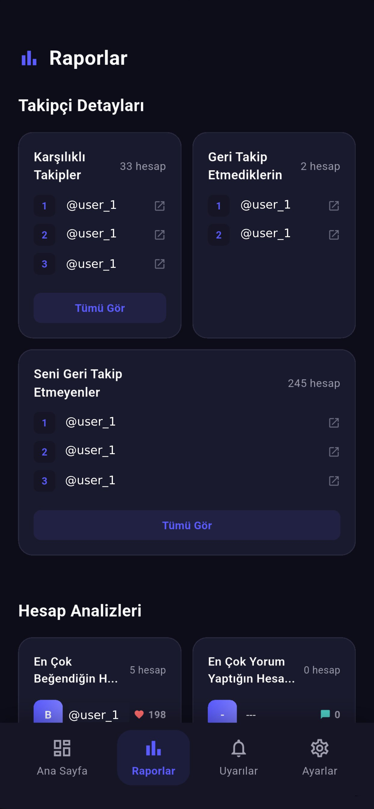
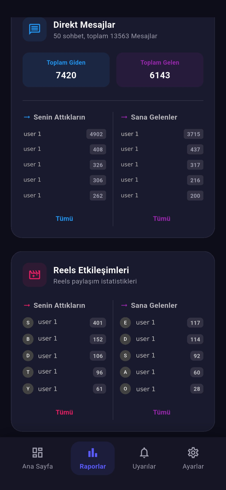
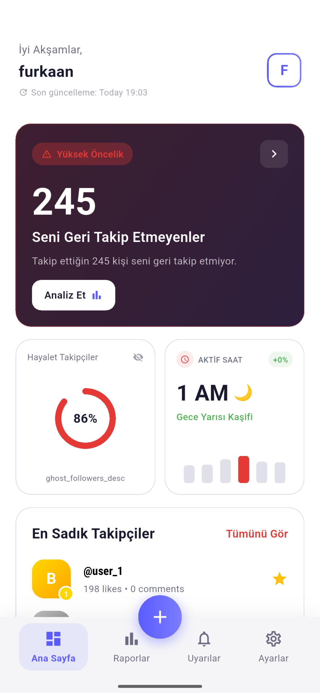

# SocialSense : Insights for Insta 📊

**SocialSense** is a secure, device-based analysis tool that provides deep insights by analyzing your Instagram data (GDPR/Data Download package).

<p align="center">
  <a href="#">
    
  </a>
  &nbsp;&nbsp;&nbsp;
  <a href="#">
    
  </a>
</p>

> **🌐 Website:** [furkanerdogan.com](https://furkanerdogan.com)

---

## 🇺🇸 English

### 🔒 Security First
**SocialSense** does **NOT** ask for your Instagram password. You do not need to log in. All analysis happens **offline on your device**. Your data is never sent to any server.

### 🌟 Features
*   **👥 Follower Analysis:**
    *   **Don't Follow Back:** Users you follow who don't follow you back.
    *   **Ghost Followers:** Followers who rarely like or comment on your posts.
    *   **Mutual Followers:** Users you follow and who follow you back.
    *   **Top Fans:** Your most loyal followers.
*   **📊 Engagement Reports:**
    *   Top Likers & Commenters.
    *   Most messaged users.
    *   Story interaction analysis.
*   **📈 Activity Charts:**
    *   Your most active hours and days.
*   **� Message & Reels Analysis:**
    *   Top users you send Reels to.
    *   Top users who send you Reels.

### 🚀 How to Use?
1.  Download and open the app.
2.  Tap on **"Start Now"**.
3.  Follow the **"How to?"** guide inside the app to request your data from Instagram (JSON format).
4.  Upload the downloaded **ZIP file** to SocialSense.
5.  All your stats will be ready in seconds!

---

## 🇹🇷 Türkçe

### 🔒 Önce Güvenlik
**SocialSense** Instagram şifrenizi **İSTEMEZ**. Giriş yapmanıza gerek yoktur. Tüm analizler **tamamen sizin cihazınızda** (offline) gerçekleşir. Verileriniz asla herhangi bir sunucuya gönderilmez.

### 🌟 Özellikler
*   **👥 Takipçi Analizi:**
    *   **Geri Takip Etmeyenler:** Sizin takip ettiğiniz ama sizi takip etmeyenler.
    *   **Hayalet Takipçiler (Ghost Followers):** Sizi takip eden ama gönderilerinizi beğenmeyen/yorum yapmayanlar.
    *   **Karşılıklı Takip:** İki taraflı takipleştiğiniz kişiler.
    *   **Hayranlarınız:** En sadık takipçileriniz.
*   **📊 Etkileşim Raporları:**
    *   En çok beğeni ve yorum yapanlar.
    *   En çok mesajlaştığınız kişiler.
    *   Hikaye (Story) etkileşimleri.
*   **📈 Aktivite Grafikleri:**
    *   En aktif olduğunuz saatler ve günler.
*   **💬 Mesaj & Reels Analizi:**
    *   En çok Reels gönderdiğiniz kişiler.
    *   Size en çok Reels gönderenler.

### � Nasıl Kullanılır?
1.  Uygulamayı indirin ve açın.
2.  **"Hemen Başla"** butonuna basın.
3.  Uygulama içindeki **"Nasıl Yapılır?"** rehberini izleyerek Instagram'dan verilerinizi indirin (JSON formatında).
4.  İndirdiğiniz **ZIP dosyasını** uygulamaya yükleyin.
5.  Saniyeler içinde tüm istatistikleriniz hazır!

---

## 📱 Screenshots / Ekran Görüntüleri

| Main Screen (Dark) | Reports (Dark) | Messages & Reels |
|:---:|:---:|:---:|
|  |  |  |
| **Light Mode** | **Alerts** | **Messaging (Light)** |
|  |  |  |

---

## � Development (Geliştirme)

This project is built with **Flutter**.

### Requirements
*   Flutter SDK (3.10.0+)
*   Dart SDK (3.0.0+)

### Installation
```bash
git clone https://github.com/KULLANICI_ADI/socialsense.git
flutter pub get
flutter run
```

---

<p align="center">
  <sub>Developed with ❤️ by <a href="https://furkanerdogan.com">Furkan Erdogan</a></sub>
</p>
